# cedar-ts

> A pure TypeScript implementation of the AWS Cedar policy language - parser, evaluator, and validator with zero dependencies.

[](https://github.com/elliot736/cedar-ts/actions/workflows/ci.yml)
[](https://typescriptlang.org)
[](LICENSE)
[]()

## Why cedar-ts?

[Cedar](https://www.cedarpolicy.com/) is AWS's open-source policy language for authorization, designed to be analyzable, auditable, and fast. The official SDK is written in Rust, with JavaScript bindings available only through a 2MB+ WASM blob that is opaque to debuggers, cannot be tree-shaken, and has limited compatibility with edge runtimes like Cloudflare Workers. **cedar-ts** is a native TypeScript reimplementation that gives you a fully debuggable, tree-shakeable, edge-ready Cedar engine in under 15KB gzipped - no WASM, no native dependencies, no async initialization.

## Features

- **Full Cedar policy language support** - `permit`, `forbid`, `when`, `unless`, annotations, all scope constraint forms
- **Entity hierarchy with transitive ancestry** - DFS resolution with cycle protection and caching
- **Schema validation at author time** - catch type errors, unknown entities, and invalid attributes before deployment
- **Zero dependencies, pure TypeScript** - nothing to audit, nothing to break
- **Edge-ready** - runs on Cloudflare Workers, Deno Deploy, Vercel Edge, Bun, Node.js, and browsers
- **Rich diagnostics** - know exactly which policies matched, which were denied, and why evaluation failed
- **Synchronous API** - no async initialization, no WASM instantiation step
- **Tree-shakeable ESM** - import only what you need; bundlers eliminate the rest

## Quick Start

```bash
npm install cedar-ts
```

```typescript
import { Authorizer, MemoryEntityStore } from "cedar-ts";

const entities = new MemoryEntityStore([
  { uid: { type: "User", id: "alice" }, attrs: { role: "admin" }, parents: [{ type: "Team", id: "engineering" }] },
  { uid: { type: "Team", id: "engineering" }, attrs: {}, parents: [] },
  { uid: { type: "Document", id: "roadmap" }, attrs: { isPublic: false }, parents: [{ type: "Folder", id: "docs" }] },
  { uid: { type: "Folder", id: "docs" }, attrs: {}, parents: [] },
]);

const authorizer = Authorizer.fromText(`
  permit(
    principal in Team::"engineering",
    action == Action::"view",
    resource in Folder::"docs"
  ) when { principal.role == "admin" };
`, entities);

const response = authorizer.isAuthorized({
  principal: { type: "User", id: "alice" },
  action: { type: "Action", id: "view" },
  resource: { type: "Document", id: "roadmap" },
  context: {},
});

console.log(response.decision);           // "allow"
console.log(response.diagnostics.reasons); // ["policy0"]
```

## Usage

### Parsing Policies

```typescript
import { parsePolicies, parseExpression } from "cedar-ts";

const { policies } = parsePolicies(`
  @id("admin-access")
  permit(
    principal in Group::"admins",
    action,
    resource in Folder::"shared"
  ) when { resource.isPublished == true };

  forbid(principal, action == Action::"delete", resource)
  when { resource has classification && resource.classification == "internal" };
`);

console.log(policies.length);        // 2
console.log(policies[0].effect);     // "permit"
console.log(policies[0].conditions); // [{ kind: "when", body: { ... } }]

// Parse standalone expressions for tooling / editors
const expr = parseExpression('resource.tags.contains("public")');
console.log(expr.kind); // "method_call"
```

### Entity Store

```typescript
import { MemoryEntityStore } from "cedar-ts";

const store = new MemoryEntityStore([
  { uid: { type: "User", id: "alice" },    attrs: { role: "admin" }, parents: [{ type: "Group", id: "eng" }] },
  { uid: { type: "Group", id: "eng" },     attrs: {},               parents: [{ type: "Org", id: "acme" }] },
  { uid: { type: "Org", id: "acme" },      attrs: {},               parents: [] },
]);

// Transitive ancestry resolution
const ancestors = store.getAncestors({ type: "User", id: "alice" });
// Set { 'Group::"eng"', 'Org::"acme"' }

// Dynamic updates
store.add({ uid: { type: "User", id: "bob" }, attrs: { role: "viewer" }, parents: [{ type: "Group", id: "eng" }] });
store.remove({ type: "User", id: "bob" });
```

### Authorization

```typescript
import { Authorizer, MemoryEntityStore } from "cedar-ts";

const store = new MemoryEntityStore([
  { uid: { type: "User", id: "alice" }, attrs: {}, parents: [] },
]);

const auth = Authorizer.fromText(`
  permit(principal == User::"alice", action == Action::"read", resource);
  forbid(principal, action == Action::"read", resource)
  unless { resource.isPublic == true };
`, store);

// Permit matches, but forbid also matches (resource has no isPublic attr -> error -> forbid doesn't match)
// Result: allowed by permit
const result = auth.isAuthorized({
  principal: { type: "User", id: "alice" },
  action: { type: "Action", id: "read" },
  resource: { type: "Document", id: "doc1" },
  context: {},
});

console.log(result.decision);             // "allow"
console.log(result.diagnostics.reasons);   // ["policy0"]
console.log(result.diagnostics.errors);    // [EvaluationError] (forbid errored on missing entity)
```

### Schema Validation

```typescript
import { parsePolicies, validatePolicies } from "cedar-ts";
import type { CedarSchema } from "cedar-ts";

const schema: CedarSchema = {
  entityTypes: {
    User:     { shape: { type: "Record", attributes: { name: { type: { type: "String" } }, role: { type: { type: "String" } } } } },
    Document: { shape: { type: "Record", attributes: { title: { type: { type: "String" } }, isPublic: { type: { type: "Boolean" } } } } },
  },
  actions: {
    view: { appliesTo: { principalTypes: ["User"], resourceTypes: ["Document"] } },
  },
};

const { policies } = parsePolicies(`
  permit(principal == User::"alice", action == Action::"view", resource)
  when { resource.isPublic == true };
`);

const result = validatePolicies(policies, schema);
console.log(result.valid);  // true
console.log(result.errors); // []
```

### Multi-Tenant SaaS Example

```typescript
import { Authorizer, MemoryEntityStore } from "cedar-ts";

const store = new MemoryEntityStore([
  // Tenants
  { uid: { type: "Tenant", id: "acme" }, attrs: { plan: "enterprise" }, parents: [] },
  // Users
  { uid: { type: "User", id: "alice" }, attrs: { role: "admin" },  parents: [{ type: "Tenant", id: "acme" }] },
  { uid: { type: "User", id: "bob" },   attrs: { role: "viewer" }, parents: [{ type: "Tenant", id: "acme" }] },
  { uid: { type: "User", id: "carol" }, attrs: { role: "admin" },  parents: [{ type: "Tenant", id: "initech" }] },
  // Resources
  { uid: { type: "Document", id: "roadmap" }, attrs: { isPublic: false }, parents: [{ type: "Tenant", id: "acme" }] },
]);

const authorizer = Authorizer.fromText(`
  // Admins can do anything in their tenant
  permit(principal, action, resource in Tenant::"acme")
  when { principal in Tenant::"acme" && principal.role == "admin" };

  // Viewers can only read in their tenant
  permit(principal in Tenant::"acme", action == Action::"read", resource in Tenant::"acme")
  when { principal.role == "viewer" };
`, store);

authorizer.isAuthorized({ principal: { type: "User", id: "alice" }, action: { type: "Action", id: "write" }, resource: { type: "Document", id: "roadmap" }, context: {} }).decision;
// => "allow" (admin)

authorizer.isAuthorized({ principal: { type: "User", id: "bob" }, action: { type: "Action", id: "write" }, resource: { type: "Document", id: "roadmap" }, context: {} }).decision;
// => "deny" (viewer, write not permitted)

authorizer.isAuthorized({ principal: { type: "User", id: "bob" }, action: { type: "Action", id: "read" }, resource: { type: "Document", id: "roadmap" }, context: {} }).decision;
// => "allow" (viewer, read permitted)

authorizer.isAuthorized({ principal: { type: "User", id: "carol" }, action: { type: "Action", id: "read" }, resource: { type: "Document", id: "roadmap" }, context: {} }).decision;
// => "deny" (different tenant)
```

## API Reference

### `parsePolicies(source: string): PolicySet`

Parse Cedar policy text into an AST. Returns `{ policies: Policy[] }`.

### `parseExpression(source: string): Expr`

Parse a standalone Cedar expression. Useful for tooling, editors, and testing.

### `class Authorizer`

High-level authorization engine.

```typescript
// Create from Cedar text
const auth = Authorizer.fromText(policyText, entityStore);

// Create from pre-parsed policies
const auth = new Authorizer(policies, entityStore);

// Evaluate a request
const result: AuthorizationResponse = auth.isAuthorized(request);

// Runtime policy management
auth.addPoliciesFromText(morePolicies);
auth.addPolicies(parsedPolicies);
auth.setEntityStore(newStore);
auth.getPolicies(); // readonly access
```

### `class MemoryEntityStore`

In-memory entity store with cached transitive ancestry.

```typescript
const store = new MemoryEntityStore(entities?);
store.add(entity);
store.remove(uid);
store.get(uid);            // Entity | undefined
store.getAncestors(uid);   // Set<string>
store.size;                // number
```

### `validatePolicies(policies: Policy[], schema: CedarSchema): ValidationResult`

Static validation of policies against a schema. Checks entity types, actions, attribute accesses, and type compatibility.

### `evaluate(policies, entityStore, request): AuthorizationResponse`

Low-level evaluation function. Use `Authorizer` for a higher-level API.

## Architecture

### Class Diagram

```plantuml
@startuml cedar-ts-class-diagram

skinparam classAttributeIconSize 0
skinparam linetype ortho
skinparam packageStyle rectangle

title cedar-ts Class Diagram

' ============================================================
' Parser / AST
' ============================================================
package "parser/ast" {

  class Position {
    +offset: number
    +line: number
    +column: number
  }

  class Span {
    +start: Position
    +end: Position
  }

  enum Effect {
    permit
    forbid
  }

  class Policy {
    +id: string
    +effect: Effect
    +principal: PrincipalConstraint
    +action: ActionConstraint
    +resource: ResourceConstraint
    +conditions: Condition[]
    +span: Span
  }

  class EntityUIDLiteral {
    +type: string
    +id: string
  }

  ' --- Principal constraints ---
  abstract class PrincipalConstraint {
    +kind: string
  }
  class PrincipalAny {
    +kind: "any"
  }
  class PrincipalEq {
    +kind: "eq"
    +entity: EntityUIDLiteral
  }
  class PrincipalIn {
    +kind: "in"
    +entity: EntityUIDLiteral
  }
  class PrincipalIs {
    +kind: "is"
    +entityType: string
  }
  class PrincipalIsIn {
    +kind: "is_in"
    +entityType: string
    +entity: EntityUIDLiteral
  }
  PrincipalConstraint <|-- PrincipalAny
  PrincipalConstraint <|-- PrincipalEq
  PrincipalConstraint <|-- PrincipalIn
  PrincipalConstraint <|-- PrincipalIs
  PrincipalConstraint <|-- PrincipalIsIn

  ' --- Action constraints ---
  abstract class ActionConstraint {
    +kind: string
  }
  class ActionAny {
    +kind: "any"
  }
  class ActionEq {
    +kind: "eq"
    +entity: EntityUIDLiteral
  }
  class ActionIn {
    +kind: "in"
    +entity: EntityUIDLiteral
  }
  class ActionInSet {
    +kind: "in_set"
    +entities: EntityUIDLiteral[]
  }
  ActionConstraint <|-- ActionAny
  ActionConstraint <|-- ActionEq
  ActionConstraint <|-- ActionIn
  ActionConstraint <|-- ActionInSet

  ' --- Resource constraints ---
  abstract class ResourceConstraint {
    +kind: string
  }
  class ResourceAny {
    +kind: "any"
  }
  class ResourceEq {
    +kind: "eq"
    +entity: EntityUIDLiteral
  }
  class ResourceIn {
    +kind: "in"
    +entity: EntityUIDLiteral
  }
  class ResourceIs {
    +kind: "is"
    +entityType: string
  }
  class ResourceIsIn {
    +kind: "is_in"
    +entityType: string
    +entity: EntityUIDLiteral
  }
  ResourceConstraint <|-- ResourceAny
  ResourceConstraint <|-- ResourceEq
  ResourceConstraint <|-- ResourceIn
  ResourceConstraint <|-- ResourceIs
  ResourceConstraint <|-- ResourceIsIn

  ' --- Condition ---
  class Condition {
    +kind: "when" | "unless"
    +body: Expr
  }

  ' --- Expr union hierarchy ---
  abstract class Expr {
    +kind: string
    +span: Span
  }

  class LiteralExpr {
    +kind: "literal"
    +value: boolean | number | string
  }
  class EntityUIDExpr {
    +kind: "entityUID"
    +type: string
    +id: string
  }
  class VarExpr {
    +kind: "var"
    +name: "principal" | "action" | "resource" | "context"
  }
  class SlotExpr {
    +kind: "slot"
    +name: string
  }
  class NotExpr {
    +kind: "not"
    +arg: Expr
  }
  class NegExpr {
    +kind: "neg"
    +arg: Expr
  }
  class BinaryExpr {
    +kind: "binary"
    +op: string
    +left: Expr
    +right: Expr
  }
  class IfThenElseExpr {
    +kind: "ifThenElse"
    +cond: Expr
    +then: Expr
    +else: Expr
  }
  class InExpr {
    +kind: "in"
    +left: Expr
    +right: Expr
  }
  class HasExpr {
    +kind: "has"
    +left: Expr
    +attr: string
  }
  class LikeExpr {
    +kind: "like"
    +left: Expr
    +pattern: string
  }
  class IsExpr {
    +kind: "is"
    +left: Expr
    +entityType: string
    +inExpr?: Expr
  }
  class GetAttrExpr {
    +kind: "getAttr"
    +left: Expr
    +attr: string
  }
  class MethodCallExpr {
    +kind: "methodCall"
    +left: Expr
    +name: string
    +args: Expr[]
  }
  class SetExpr {
    +kind: "set"
    +elements: Expr[]
  }
  class RecordExpr {
    +kind: "record"
    +pairs: Map<string, Expr>
  }

  Expr <|-- LiteralExpr
  Expr <|-- EntityUIDExpr
  Expr <|-- VarExpr
  Expr <|-- SlotExpr
  Expr <|-- NotExpr
  Expr <|-- NegExpr
  Expr <|-- BinaryExpr
  Expr <|-- IfThenElseExpr
  Expr <|-- InExpr
  Expr <|-- HasExpr
  Expr <|-- LikeExpr
  Expr <|-- IsExpr
  Expr <|-- GetAttrExpr
  Expr <|-- MethodCallExpr
  Expr <|-- SetExpr
  Expr <|-- RecordExpr

  Policy --> Effect
  Policy --> PrincipalConstraint
  Policy --> ActionConstraint
  Policy --> ResourceConstraint
  Policy *-- Condition
  Policy --> Span
  Condition --> Expr
  Expr --> Span
}

' ============================================================
' Parser / Tokenizer
' ============================================================
package "parser/tokenizer" {

  enum TokenKind {
    Identifier
    IntLiteral
    StringLiteral
    True
    False
    If
    Then
    Else
    Permit
    Forbid
    When
    Unless
    In
    Has
    Like
    Is
    LParen
    RParen
    LBrace
    RBrace
    LBracket
    RBracket
    Comma
    Semicolon
    Colon
    DoubleColon
    Dot
    Plus
    Dash
    Star
    Eq
    NotEq
    Lt
    LtEq
    Gt
    GtEq
    And
    Or
    Not
    At
    EOF
    ...
  }

  class Token {
    +kind: TokenKind
    +value: string
    +pos: Position
  }

  class Tokenizer {
    -source: string
    -pos: number
    +peekToken(): Token
    +nextToken(): Token
    +expect(kind: TokenKind): Token
    +isAtEnd(): boolean
  }

  Token --> TokenKind
  Token --> Position
  Tokenizer ..> Token : produces
}

' ============================================================
' Parser
' ============================================================
package "parser/parser" {

  class ParseError {
    +message: string
    +span?: Span
  }

  class PolicySet {
    +policies: Policy[]
  }

  class "parsePolicies()" as parsePolicies <<function>> {
    +parsePolicies(source: string): PolicySet
  }

  class "parseExpression()" as parseExpression <<function>> {
    +parseExpression(source: string): Expr
  }

  parsePolicies ..> PolicySet : returns
  parsePolicies ..> Tokenizer : uses
  parseExpression ..> Expr : returns
  parseExpression ..> Tokenizer : uses
}

' ============================================================
' Evaluator / Values
' ============================================================
package "evaluator/values" {

  class EntityUID {
    +type: string
    +id: string
  }

  abstract class CedarValue {
    boolean | number | string
    | EntityUID | CedarSet
    | CedarRecord | CedarExtension
  }

  class CedarSet {
    -elements: CedarValue[]
    +contains(v: CedarValue): boolean
    +containsAll(other: CedarSet): boolean
    +containsAny(other: CedarSet): boolean
  }

  class CedarRecord <<type>> {
    +[key: string]: CedarValue
  }

  CedarValue <|.. EntityUID
  CedarValue <|.. CedarSet
  CedarValue <|.. CedarRecord
}

' ============================================================
' Evaluator / Context
' ============================================================
package "evaluator/context" {

  class Request {
    +principal: EntityUID
    +action: EntityUID
    +resource: EntityUID
    +context: CedarRecord
  }

  Request --> EntityUID
  Request --> CedarRecord
}

' ============================================================
' Evaluator
' ============================================================
package "evaluator/evaluator" {

  enum Decision {
    allow
    deny
  }

  class Diagnostics {
    +reasons: string[]
    +errors: string[]
  }

  class AuthorizationResponse {
    +decision: Decision
    +diagnostics: Diagnostics
  }

  class EvaluationError {
    +message: string
  }

  class "evaluate()" as evaluate <<function>> {
    +evaluate(policy, request, store): boolean
  }

  class "evalExpr()" as evalExpr <<function>> {
    +evalExpr(expr, env): CedarValue
  }

  AuthorizationResponse --> Decision
  AuthorizationResponse *-- Diagnostics
  evaluate ..> Request : reads
  evaluate ..> Policy : evaluates
  evalExpr ..> Expr : walks
  evalExpr ..> CedarValue : returns
}

' ============================================================
' Entities
' ============================================================
package "entities" {

  class Entity {
    +uid: EntityUID
    +attrs: CedarRecord
    +parents: EntityUID[]
  }

  interface EntityStore {
    +get(uid: EntityUID): Entity | undefined
    +getAncestors(uid: EntityUID): Set<EntityUID>
  }

  class MemoryEntityStore {
    -entities: Map<string, Entity>
    -ancestorCache: Map<string, Set<EntityUID>>
    +get(uid: EntityUID): Entity | undefined
    +getAncestors(uid: EntityUID): Set<EntityUID>
  }

  EntityStore <|.. MemoryEntityStore
  MemoryEntityStore o-- Entity
  Entity --> EntityUID
}

' ============================================================
' Schema
' ============================================================
package "schema" {

  class CedarSchema {
    +namespace: string
    +entityTypes: Map<string, EntityTypeSchema>
    +actions: Map<string, ActionSchema>
  }

  class EntityTypeSchema {
    +memberOfTypes?: string[]
    +shape?: TypeSchema
  }

  class ActionSchema {
    +appliesTo?: AppliesToSchema
    +memberOf?: EntityUIDLiteral[]
  }

  abstract class TypeSchema {
    +kind: string
  }
  class PrimitiveType {
    +kind: "Primitive"
    +primitiveType: "Boolean" | "Long" | "String"
  }
  class SetType {
    +kind: "Set"
    +element: TypeSchema
  }
  class RecordType {
    +kind: "Record"
    +attributes: Map<string, AttributeSchema>
  }
  class EntityRefType {
    +kind: "EntityRef"
    +entityType: string
  }

  class AttributeSchema {
    +type: TypeSchema
    +required: boolean
  }

  TypeSchema <|-- PrimitiveType
  TypeSchema <|-- SetType
  TypeSchema <|-- RecordType
  TypeSchema <|-- EntityRefType
  RecordType *-- AttributeSchema
  AttributeSchema --> TypeSchema

  CedarSchema *-- EntityTypeSchema
  CedarSchema *-- ActionSchema
  EntityTypeSchema --> TypeSchema

  class ValidationError {
    +message: string
    +policyId: string
    +span?: Span
  }

  class ValidationResult {
    +valid: boolean
    +errors: ValidationError[]
  }

  class "validatePolicies()" as validatePolicies <<function>> {
    +validatePolicies(policies, schema): ValidationResult
  }

  validatePolicies ..> ValidationResult : returns
  validatePolicies ..> CedarSchema : reads
  ValidationResult *-- ValidationError
}

' ============================================================
' Authorizer
' ============================================================
package "authorizer" {

  class Authorizer {
    -policies: Policy[]
    -entityStore: EntityStore
    +fromText(source: string): void
    +isAuthorized(request: Request): AuthorizationResponse
    +setEntityStore(store: EntityStore): void
    +addPolicies(source: string): void
    +getPolicies(): Policy[]
  }

  Authorizer --> EntityStore : uses
  Authorizer --> Policy : manages
  Authorizer ..> AuthorizationResponse : returns
  Authorizer ..> Request : accepts
}

@enduml
```



### Component Diagram

```plantuml
@startuml cedar-ts-component-diagram

skinparam componentStyle uml2
skinparam linetype ortho

title cedar-ts Component Diagram

package "cedar-ts" {

  ' ============================================================
  ' Parser layer
  ' ============================================================
  package "Parser" {
    [Tokenizer] as tokenizer
    [Parser] as parser
    [AST Types] as ast

    note right of tokenizer
      Lexes Cedar source into
      60+ token kinds
    end note

    tokenizer --> ast : produces Token\n(kind, value, pos)
    parser --> tokenizer : peekToken()\nnextToken()\nexpect()
    parser --> ast : builds Policy[]\nand Expr tree
  }

  ' ============================================================
  ' Evaluator layer
  ' ============================================================
  package "Evaluator" {
    [Values] as values
    [Context] as context
    [Evaluator] as evaluator

    note right of evaluator
      Walks Expr AST,
      resolves variables from
      Request + EntityStore
    end note

    evaluator --> values : produces CedarValue
    evaluator --> context : reads Request\n{principal, action,\nresource, context}
  }

  ' ============================================================
  ' Entities layer
  ' ============================================================
  package "Entities" {
    interface "EntityStore" as es_iface
    [MemoryEntityStore] as memstore
    [Entity] as entity

    note right of memstore
      Map-based store with
      DFS ancestor caching
    end note

    memstore ..|> es_iface
    memstore --> entity : stores
  }

  ' ============================================================
  ' Schema layer
  ' ============================================================
  package "Schema" {
    [CedarSchema] as schema_def
    [Validator] as validator

    note right of validator
      Type-checks policies
      against entity/action
      schema definitions
    end note

    validator --> schema_def : reads EntityTypeSchema\nActionSchema\nTypeSchema
  }

  ' ============================================================
  ' Authorizer (top-level facade)
  ' ============================================================
  [Authorizer] as authorizer

  note top of authorizer
    Public API facade:
    fromText(), isAuthorized(),
    setEntityStore(), addPolicies()
  end note
}

' ============================================================
' External boundary
' ============================================================
actor "Application" as app

' ============================================================
' Cross-package relationships
' ============================================================

' Authorizer orchestrates everything
authorizer --> parser : parsePolicies(source)
authorizer --> evaluator : evaluate(policy, request, store)
authorizer --> es_iface : get(), getAncestors()
authorizer --> validator : validatePolicies()

' Evaluator depends on entities for hierarchy lookups
evaluator --> es_iface : get(uid)\ngetAncestors(uid)

' Evaluator walks the AST produced by parser
evaluator --> ast : walks Expr nodes

' Validator reads AST for type checking
validator --> ast : inspects Policy +\nExpr nodes

' Application entry point
app --> authorizer : isAuthorized(request)
app --> memstore : provides Entity[]

' ============================================================
' Data flow note
' ============================================================
note bottom of authorizer
  **Authorization flow:**
  1. Application calls fromText() to load Cedar policies
  2. Parser tokenizes source and builds AST (Policy[], Expr tree)
  3. Optionally, Validator checks policies against CedarSchema
  4. Application calls isAuthorized(request)
  5. Evaluator walks each Policy's Expr tree
  6. EntityStore resolves entity lookups and ancestor queries
  7. Authorizer combines per-policy results: forbid overrides permit
  8. Returns AuthorizationResponse {decision, diagnostics}
end note

@enduml
```



## Algorithm & Design Decisions

- **Recursive descent parser** - hand-written for full control over error messages and zero parser-generator dependencies
- **Default deny** - if no `permit` policy matches, the request is denied (matches Cedar specification)
- **Forbid wins** - a single matching `forbid` overrides any number of matching `permit` policies
- **Transitive ancestry** - DFS traversal with cycle protection via a visited set, results cached per entity and invalidated on store mutation
- **Short-circuit evaluation** - `&&` and `||` short-circuit, matching Cedar's defined evaluation order

See [Architecture Decision Records](docs/adr/) for detailed rationale behind each design choice.

## Performance

| Operation | Scale | Time |
|-----------|-------|------|
| Parse | 100 policies | < 5ms |
| Evaluate | 100 policies x 1 request | < 1ms |
| Entity ancestry | 20-level hierarchy | < 0.1ms |
| Full authorization | 100 entities, complex policies | < 2ms |

Sub-millisecond evaluation for typical workloads (< 100 policies). Benchmarked on Node.js 20, Apple M-series.

## Comparison

| Feature | cedar-ts | @cedar-policy/cedar-wasm | Custom if/else |
|---------|----------|--------------------------|----------------|
| Runtime | Native TS | WASM blob | N/A |
| Bundle size | ~15KB | ~2MB | Grows with rules |
| Debuggable | Step-through | Opaque | Step-through |
| Edge runtime | Full support | Limited WASM support | Full support |
| Auditable | Policy files | Policy files | Scattered code |
| Type-safe validation | Schema validation | Schema validation | Manual |
| Tree-shakeable | Yes | No | N/A |
| Dependencies | 0 | Native/WASM | N/A |
| Async init | No | Required | No |

## Contributing

1. Fork the repository
2. Create a feature branch: `git checkout -b feature/my-feature`
3. Write tests for your changes
4. Ensure all checks pass: `npm run lint && npm run typecheck && npm test`
5. Submit a pull request

## License

MIT

---
